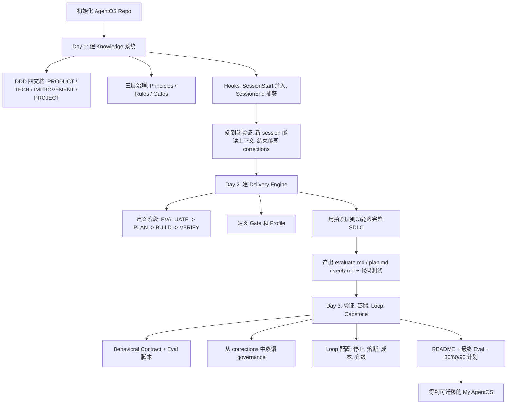
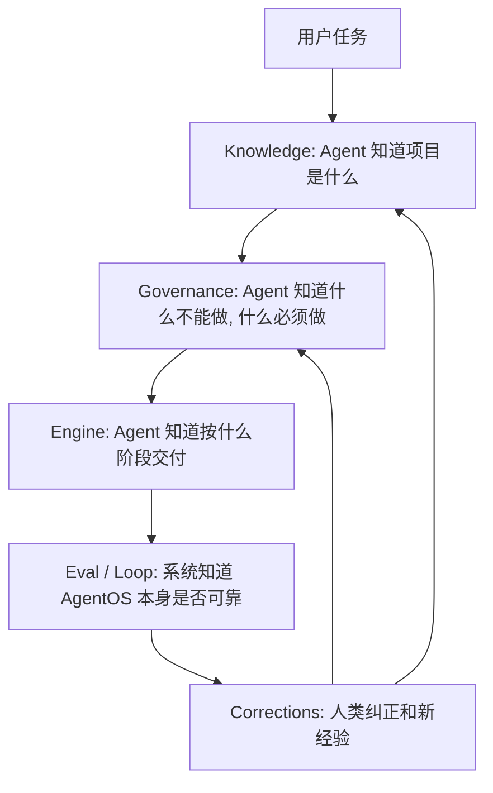
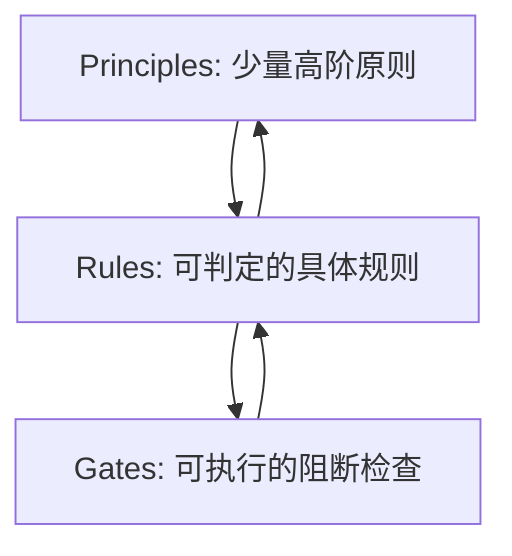
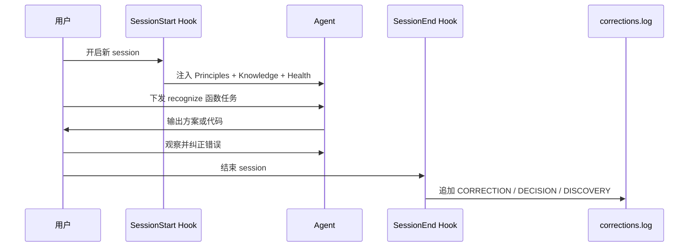
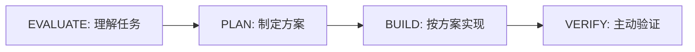
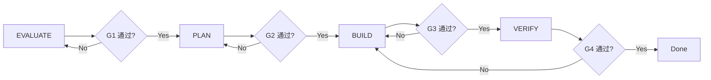
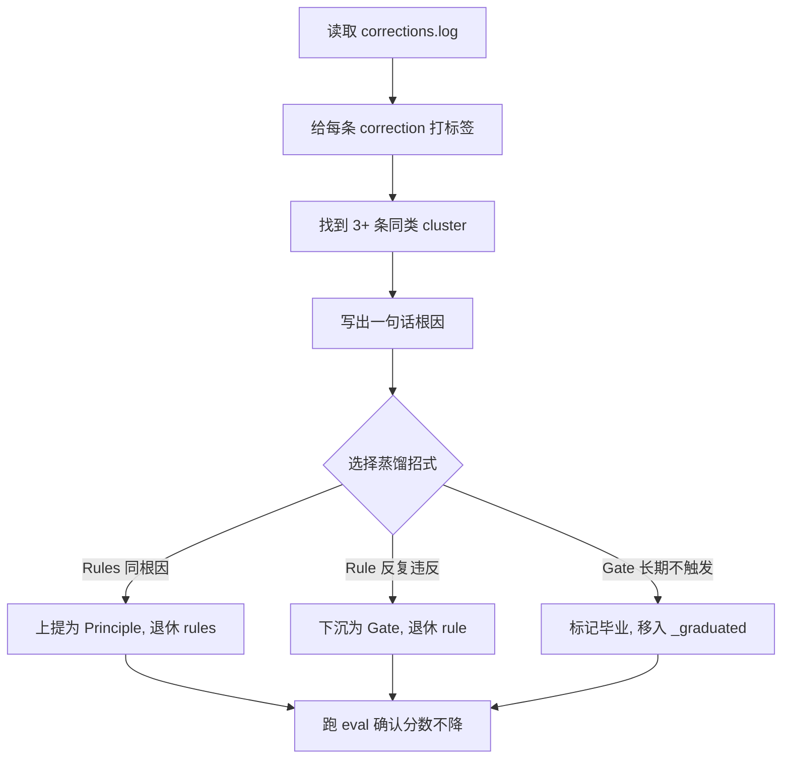
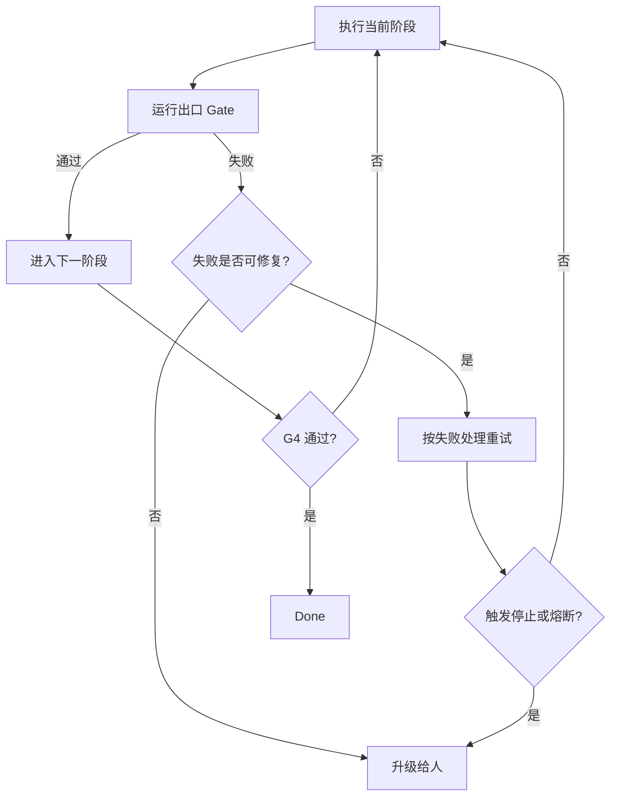
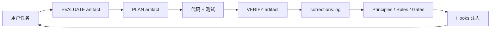

# LAB-MANUAL 整体思路整理

> 对应原文件：`LAB-MANUAL.md`
>
> 这份整理的目标不是替代操作手册，而是帮你先看懂整套练习的结构：为什么按这个顺序做、每个模块解决什么问题、模块之间如何形成闭环。

## 1. 一句话理解这个练习

这套 Lab 的本质是：以“错题本”项目为载体，三天内搭建一个属于你的 AgentOS，让 Agent 不只是会写代码，而是能带着项目知识工作、遵守治理规则、按交付流程推进、接受验证、从错误中蒸馏经验，并逐步进入可控的自动循环。

换句话说，它不是一个普通的“实现拍照识别功能”的练习，而是一个“建设 Agent 工作系统”的练习。

## 2. 最终要搭出来什么

最终仓库大致长这样：

```text
my-agentos/
├── knowledge/        # 项目知识：产品、技术、改进方向、当前状态
├── governance/       # 治理系统：原则、规则、门禁
├── engine/           # 交付引擎：阶段、Gate、Profile、状态、Loop
├── hooks/            # Claude Code 生命周期钩子：启动注入、结束捕获
├── spec/             # 任务过程产物：evaluate、plan、verify
├── eval/             # 行为验证：golden set + eval 脚本
├── ci/               # 业务验证脚本
├── docs/             # 30/60/90 行动计划等
└── corrections.log   # Agent 被纠正、做出决策、发现事实的记录
```

这些目录不是“文件分类”那么简单，它们共同构成几个闭环：

| 闭环 | 作用 | 关键文件 |
| --- | --- | --- |
| Knowledge 闭环 | 让 Agent 每次启动都知道项目上下文，并在结束时捕获新经验 | `knowledge/*`, `hooks/*`, `corrections.log` |
| Governance 闭环 | 把经验沉淀成原则、规则和可执行 Gate | `governance/principles.md`, `governance/rules/*`, `governance/gates/*` |
| Delivery 闭环 | 让任务按阶段推进，避免直接冲进实现 | `engine/stages.md`, `engine/gates.md`, `engine/profiles.md`, `engine/STATE.md`, `spec/*` |
| Eval 闭环 | 验证 AgentOS 自身是否真的有效 | `eval/golden-set.md`, `eval/run-eval.sh`, `ci/verify.sh` |
| Loop 闭环 | 定义什么时候可以自动跑、什么时候必须停下来找人 | `engine/loop-config.md`, `engine/gates.md` |

## 3. 总流程图



## 4. 学习这份手册时要抓住的主线

你可以把整个练习理解成四层系统：



这条主线很关键：

1. 先有项目知识，否则 Agent 只能凭通用经验工作。
2. 再有治理规则，否则 Agent 很容易“看起来完成了”，但没有验证、没有边界、没有质量标准。
3. 再有交付引擎，否则任务会直接从需求跳到代码，中间的理解和计划不可控。
4. 最后有 Eval、蒸馏和 Loop，否则系统无法自我改进，也不敢逐步放权。

## 5. 环境准备

环境准备很简单，但它定义了整个实验的工作边界。

### 要做什么

1. 确认 Claude Code CLI 可用。
2. 确认当前在 workshop 工作目录。
3. 创建 `my-agentos` 仓库，并初始化 git。

### 为什么要这样做

后面所有实验产物都放进这个 repo。这个 repo 最后不是一次性作业，而是一个可以迁移到真实项目里的 AgentOS 模板。

### 判断点

你从一开始就要把它当成“可维护系统”而不是“课堂临时文件夹”。所以目录结构、命名、脚本权限、git 记录都很重要。

## 6. Day 1: AgentOS 全景 + Knowledge 模块

Day 1 的核心目标：让 Agent 拥有项目记忆，并建立最初的治理框架。

它解决的问题是：Agent 每次打开都是“失忆状态”，不知道项目产品、技术约束、当前进展，也不知道你过去纠正过它什么。Day 1 要把这些上下文变成可注入、可捕获、可健康检查的系统。

### Lab 1: 初始化 Knowledge 骨架

#### 目标

创建 AgentOS 的知识层，包括四份 DDD 文档和一个 session 结束时的 Capture Hook。

#### 模块含义

`knowledge/` 是 Agent 的项目记忆。它不是随便写的说明文档，而是为了让 Agent 在做任务前能快速知道：

- 产品是什么。
- 用户是谁。
- 核心业务规则是什么。
- 技术栈和不可逆技术决策是什么。
- 当前项目状态是什么。
- 哪些方向优先，哪些事情禁止做。

#### 四份核心文档

| 文件 | 作用 | 重点 |
| --- | --- | --- |
| `PRODUCT.md` | 产品和业务知识 | 用户、核心问题、核心概念、业务规则 |
| `TECH.md` | 技术和架构知识 | 技术栈、ADR、接口契约 |
| `IMPROVEMENT.md` | 改进方向和禁区 | 优先级、技术债、禁止事项 |
| `PROJECT.md` | 当前项目状态 | Sprint、进行中、阻塞 |

#### 关键理解

`PRODUCT.md` 里的阈值不是随便填空。比如 confidence 阈值、连续 N 次正确这些数字，必须写清楚：

- 选择了什么值。
- 为什么不是更低或更高。
- 如何判定这个值有效。

这其实是在训练你把“模糊偏好”变成“可执行约束”。

#### Capture Hook 做什么

`hooks/on-session-end.sh` 会在 session 结束时调用 Claude，总结本次会话中的：

- `CORRECTION`: 用户纠正过 Agent 什么。
- `DECISION`: 本次做了什么决策以及理由。
- `DISCOVERY`: 新发现了什么事实。

这些内容会追加到 `corrections.log`。

#### 为什么重要

没有 Capture Hook，Agent 犯过的错不会留下来。下一次它还会犯同样的错。`corrections.log` 是后面蒸馏治理规则的原材料。

### Lab 2: 设计三层治理

#### 目标

把“你希望 Agent 怎样工作”拆成三层：



#### 三层分别是什么

| 层级 | 解决什么问题 | 例子 |
| --- | --- | --- |
| Principles | 高阶判断标准，数量少但覆盖广 | “完成 = 主动破坏且失败” |
| Rules | 具体、可判定、可追溯、可过期 | “识别接口必须返回完整 schema” |
| Gates | 可以自动执行或阻断流程的检查 | `check-lint.sh` |

#### Principles 的重点

Principle 不能只是口号，必须能回答“做到了没有”。

比如“代码要高质量”太虚；“完成 = 主动尝试破坏且失败”就可判定，因为可以要求 verify artifact 记录破坏尝试。

#### Rules 的重点

每条 Rule 必须有三部分：

1. 追溯：它来自哪个 Principle，或者来自哪些 corrections。
2. 判定标准：如何判断是否违反。
3. 过期条件：什么时候可以退休或重新评估。

这能防止规则无限膨胀。

#### Gates 的重点

Gate 是能执行的检查。比如 lint、测试、schema 验证、无 secrets。它比 Rule 更强，因为它可以阻断流程。

#### 这一 Lab 的深层目的

把“人类经验”变成“系统约束”。越能自动检查的东西，越应该从 Rule 下沉到 Gate。

### Lab 3: 实现 Retrieve + Health

#### 目标

让 Knowledge 在每个 session 开始时自动注入，并能检查自身健康状态。

#### SessionStart Hook 的工作

`hooks/on-session-start.sh` 会按优先级输出上下文：

1. Principles: 最高优先级约束。
2. Engine 当前状态: 如果有 `engine/STATE.md`。
3. DDD 摘要: `PRODUCT / TECH / IMPROVEMENT / PROJECT` 的摘要。
4. 禁止事项: 从 `IMPROVEMENT.md` 中提取。
5. Health summary: 运行健康检查后输出摘要。

#### 为什么注入顺序重要

最先注入的内容更容易被 Agent 注意到。所以 Principles 放在最前面。当前状态也很重要，因为 Agent 要知道自己是在新任务开始，还是在某个阶段续做。

#### Health Check 检查什么

`knowledge/health.sh` 主要检查三类问题：

| 检查 | 目的 |
| --- | --- |
| 新鲜度 | 防止 `PROJECT.md` 等状态文档过期 |
| 体积 | 防止注入内容太多，超过上下文预算 |
| Rules 数量 | 防止规则越堆越多，失去治理效率 |

#### 关键理解

Knowledge 系统也会“生病”。比如文档过期、规则膨胀、注入内容太大。Health Check 就是为了让你定期维护它。

### Lab 4: Knowledge 端到端整合验证

#### 目标

跑一次完整 session，验证 Knowledge 的闭环是否成立。

#### 流程图



#### 为什么要故意等 Agent 犯错

这个 Lab 不只是为了完成 recognize 函数，而是为了观察：

- Agent 是否真的吸收了注入的 principles。
- 它会在哪些地方偏离。
- 用户纠正能否被捕获到 `corrections.log`。

#### 验证重点

你要确认三件事：

1. 新 session 中 Agent 能复述 principles。
2. 工作时至少部分受 principles 影响。
3. 结束后 corrections 被正确记录。

## 7. Day 2: Delivery Engine 设计 + SDLC 实弹

Day 2 的核心目标：让 Agent 从“能写代码”升级为“按交付流程推进任务”。

它解决的问题是：Agent 很容易直接从需求跳到实现，跳过理解、验收标准、风险识别、不可逆决策和验证。Delivery Engine 就是要把任务拆成阶段，并在阶段之间设置 Gate。

### Lab 5: 设计 Engine 阶段序列

#### 目标

定义交付流程的基本阶段。

推荐阶段是：



#### 每个阶段解决什么

| 阶段 | 目的 | 典型产出 |
| --- | --- | --- |
| EVALUATE | 确保理解正确，不在错误方向上加速 | `evaluate-{id}.md` |
| PLAN | 在不可逆决策前想清楚方案 | `plan-{id}.md` |
| BUILD | 按计划实现，不再做方向性决策 | 代码 + 测试 |
| VERIFY | 主动破坏并验证完成度 | `verify-{id}.md` |

#### 判断阶段边界的方法

手册给了一个很好的判断标准：不可逆边界。

- 两个阶段之间如果没有不可逆边界，可以考虑合并。
- 一个阶段内部如果包含明显不可逆决策，可以考虑拆分。

#### 关键理解

阶段不是为了流程感，而是为了在关键决策前停一下。尤其是 PLAN 阶段，它阻止 Agent 一边写代码一边临时改变架构方向。

### Lab 6: 设计门禁 + Profiles

#### 目标

为阶段之间设置 Gate，并定义不同任务类型走什么流程。

#### Gates 是什么

Gate 是阶段出口条件。比如：



#### 四个 Gate 的含义

| Gate | 阶段转换 | 重点检查 |
| --- | --- | --- |
| G1 | EVALUATE -> PLAN | AC 是否可判定、不可逆决策是否声明 |
| G2 | PLAN -> BUILD | 方案是否覆盖 AC、风险是否识别、ADR 是否记录 |
| G3 | BUILD -> VERIFY | 代码、测试、lint、secrets 等自动检查 |
| G4 | VERIFY -> Done | 所有 AC 是否 pass、是否有主动破坏记录 |

#### Gate 级别

| 级别 | 谁判定 | 适合什么 |
| --- | --- | --- |
| L1 | AI 自查或自动脚本 | 格式、数量、测试、lint |
| L2 | AI 互查或 devil's advocate | 方案质量、风险完整性 |
| L3 | 人类审批 | 不可逆架构决策、数据迁移 |

#### Profiles 是什么

Profile 定义不同任务类型的流程路径。

| Profile | 路径 | 适用场景 |
| --- | --- | --- |
| feature | EVALUATE -> PLAN -> BUILD -> VERIFY | 新功能、重大变更 |
| bugfix | EVALUATE -> BUILD -> VERIFY | 已知 bug，方向明确 |
| hotfix | BUILD -> VERIFY | 紧急修复 |
| refactor | PLAN -> BUILD -> VERIFY | 不改行为，只改结构 |

#### STATE.md 的作用

`engine/STATE.md` 是当前任务的仪表盘，记录：

- 任务是什么。
- 使用什么 profile。
- 当前阶段在哪里。
- 哪些 Gates 已通过。
- 开始时间。

这样 Agent 在中断后恢复时，不会重新猜当前进度。

### Lab 7: SDLC 实弹 - EVALUATE + PLAN

#### 目标

用“拍照识别”功能跑 Delivery Engine 前半段。

任务是：

```text
用户拍照 -> 上传图片 -> Bedrock 识别 -> 返回结构化 JSON
覆盖 API 设计 + 识别逻辑 + 错误处理 + 置信度判定
```

#### EVALUATE 阶段要做什么

EVALUATE 不是写方案，而是确认问题是否理解对。

重点看 Agent 是否：

- 读了 `PRODUCT.md`。
- 输出了可判定的 AC。
- 识别了不可逆决策。
- 产出了 `spec/recognize/evaluate.md`。

AC 要能被验证。比如“识别准确”太泛；“返回 JSON 必须包含 `confidence` 且范围为 `[0,1]`”就可判定。

#### PLAN 阶段要做什么

PLAN 要把 AC 映射到具体实现方案。

重点看 Agent 是否：

- 参考了 `TECH.md` 的 ADR。
- 每条 AC 都有实现映射。
- 风险有缓解策略。
- 新增不可逆决策时记录 ADR。
- 产出了 `spec/recognize/plan.md`。

#### 关键理解

这两个阶段的目标是防止“方向错了但代码写得很快”。你要在 BUILD 前确认：

1. 我们要解决的问题是对的。
2. 验收标准是可判定的。
3. 方案覆盖了验收标准。
4. 不可逆决策被记录了。

### Lab 8: SDLC 实弹 - BUILD + VERIFY

#### 目标

用同一个任务跑 Delivery Engine 后半段：实现、测试、主动验证、回退修复。

#### BUILD 阶段要做什么

BUILD 阶段的关键约束是：不做方向性决策。

Agent 应该：

- 参考 `plan.md`。
- 遵循 `TECH.md` 的技术约束。
- 同时写代码和测试。
- 不偏离已通过的方案。
- 通过 G3 的测试、lint、secrets 检查。

如果实现过程中发现方案不对，正确做法不是在 BUILD 里偷偷改方向，而是回退 PLAN。

#### VERIFY 阶段要做什么

VERIFY 不是“看起来没问题”，而是主动破坏。

至少包括：

- 空图片。
- 超大图片。
- 非图片文件。
- Bedrock 超时。
- Bedrock 返回异常。

然后把结果写入 `spec/recognize/verify.md`。

#### 为什么 G4 第一次可能失败

这是正常的。因为主动破坏通常会发现 BUILD 没覆盖的边界。失败后回退 BUILD，修复后再 VERIFY，这才是高质量闭环。

#### Mini 蒸馏

Lab 8 结束前要快速查看 `corrections.log`，把错误按类型分组：

- 完成度问题。
- 方案偏离问题。
- 引用缺失问题。
- 格式或 schema 问题。

如果发现明显 pattern，就更新 governance。

## 8. Day 3: 验证 + 蒸馏 + Loop + Capstone

Day 3 的核心目标：让 AgentOS 从“能跑一次”变成“能被评估、能变瘦、能循环、能迁移”。

### Lab 9: 验证工程 + Eval

#### 目标

建立 AgentOS 的行为验证系统。

这一步不是验证业务代码本身，而是验证 AgentOS 是否按预期工作。

#### Behavioral Contract 是什么

`eval/golden-set.md` 记录的是行为契约，例如：

- 如果 Agent 声称完成，则 verify artifact 必须存在。
- feature 任务必须经过 EVALUATE -> PLAN -> BUILD -> VERIFY。
- 设计决策必须记录 ADR。
- G3 检查测试时，提交代码必须测试通过。
- corrections 中 3 条以上同类问题应沉淀到 governance。

#### Eval 脚本检查什么

`eval/run-eval.sh` 检查：

| 检查项 | 意义 |
| --- | --- |
| Completion Behavior | 是否有足够主动破坏尝试 |
| Engine Compliance | 是否记录了 Gate 通过情况 |
| Governance Coverage | Principles 数量是否达标 |
| Distillation Health | Rules 数量是否健康 |

#### 业务验证脚本

`ci/verify.sh` 是针对错题本识别功能的业务验证，比如：

- `confidence` 字段存在且范围为 `[0,1]`。
- `question_text` 是非空字符串。
- `knowledge_points` 是数组。

#### 关键理解

Eval 是给 AgentOS 自己打分。没有 Eval，你只能凭感觉认为系统变好了；有 Eval，才能知道当前得分和差距方向。

### Lab 10: 蒸馏工坊

#### 目标

从 corrections 中提炼治理能力，让 governance 变短但覆盖更广。

#### 蒸馏流程



#### 三种蒸馏招式

| 招式 | 信号 | 动作 |
| --- | --- | --- |
| 上提 | 3+ 条 rules 追溯到同一根因 | 强化 Principle，退休 rules |
| 下沉 | 某 Rule 被违反 3+ 次 | 写成 Gate 脚本，退休 rule |
| 毕业 | Gate 长期不触发 | 移到 `_graduated/` |

#### 为什么强调“变短”

好的治理不是越写越多。真正成熟的系统应该是：

- Principles 少而稳。
- Rules 有生命周期。
- Gates 少但有效。
- 老问题不会换个形式反复出现。

所以蒸馏后要比较行数，并跑 eval 确认质量没有下降。

### Lab 11: Loop Engineering

#### 目标

定义 AgentOS 在什么条件下可以自动循环，什么时候必须停止。

#### Loop 配置包含什么

| 类别 | 作用 | 示例 |
| --- | --- | --- |
| 停止条件 | 什么时候任务可以正常结束 | G4 通过、超时、成本上限、eval 阈值 |
| 熔断条件 | 什么时候必须立即中断 | 重复失败、成本异常、破坏性操作、API 连续异常 |
| 成本治理 | 控制 token 和费用 | 单任务预算、单 session 预算 |
| 升级策略 | 什么时候找人 | Gate 连续失败、架构 ADR、新错误类型 |

#### Loop 和 Gate 的关系

Loop 不是让 Agent 无限制自跑，而是在 Gate 框架里有条件地重复。



#### 关键理解

Loop 的核心不是“全自动”，而是“可控自动”。你要清楚哪些任务适合 loop，比如 bugfix；哪些任务永远不该放进去，比如架构选型或数据迁移。

### Lab 12: Capstone 整合

#### 目标

把前三天产物整合成一个完整、可说明、可迁移的 AgentOS。

#### 要补齐什么

1. 检查最终目录结构。
2. 确认 hooks 已注册到 `.claude/settings.json`。
3. 编写 `README.md`。
4. 运行最终 eval。
5. 提交 git commit。
6. 编写 30/60/90 行动计划。

#### README 要回答什么

README 不是普通说明，而是你这个 AgentOS 的使用入口。它要说明：

- 这个 AgentOS 是什么。
- 核心 principles 是什么。
- 如何接入项目。
- 如何做健康检查。
- 如何做行为验证。
- Engine 怎么使用。
- 多久做一次蒸馏。

#### 30/60/90 行动计划的意义

这份计划把课堂产物带回真实工作。

| 时间 | 目标 |
| --- | --- |
| 30 天 | 接入一个真实项目，跑 feature，积累 corrections，做蒸馏 |
| 60 天 | 开始渐进放权，尝试 bugfix loop |
| 90 天 | 接入第二个项目，复用跨项目 principles |

## 9. 练习中的核心产物流



这个图说明了一个重要观点：任务不是结束在代码合并，而是结束在经验被捕获、治理被更新、下一次 session 能用上。

## 10. 每个模块之间的关系

| 模块 | 输入 | 输出 | 给下游提供什么 |
| --- | --- | --- | --- |
| Knowledge | 产品/技术/项目事实 | DDD 文档 | Agent 的上下文 |
| Capture | 会话过程 | `corrections.log` | 蒸馏材料 |
| Governance | principles + corrections | rules + gates | 行为约束 |
| Retrieve | knowledge + governance | session 注入内容 | Agent 启动上下文 |
| Health | knowledge + governance 文件 | 健康状态 | 是否需要维护 |
| Engine | 用户任务 + profile | 阶段化执行 | 可控交付流程 |
| Gates | artifact + 代码 + 测试 | pass/fail | 阶段推进或回退 |
| Eval | 行为契约 + repo 状态 | score | AgentOS 是否可靠 |
| Distillation | corrections + rules | 更短的 governance | 经验升级 |
| Loop | gates + eval + budget | 自动/停止/升级决策 | 渐进放权 |

## 11. 做这个 Lab 时最容易误解的点

### 误解 1: 重点是写 recognize 函数

不是。`recognize` 只是用来测试 AgentOS 的载体。真正要练的是：Agent 是否知道上下文、能否遵守原则、是否经过阶段、是否记录验证、是否从错误中学习。

### 误解 2: Principles 写得越多越好

不是。Principles 应该 3-5 条，少而可判定。太多会变成噪声。

### 误解 3: Rules 永远保留

不是。Rules 必须可过期、可退休。如果某条 Rule 反复违反，应该考虑下沉成 Gate；如果被更高层 Principle 吸收，应退休。

### 误解 4: Gate 全部越严格越好

不是。全 L3 会让系统跑不动，全 L1 又可能放过关键风险。Gate 级别要和风险匹配。

### 误解 5: Loop 等于无人值守

不是。Loop 需要停止条件、熔断条件、成本治理和升级策略。越是自动化，越要知道什么时候停。

## 12. 推荐执行节奏

如果你要按这份手册真正做一遍，可以这样抓节奏：

1. Day 1 不要急着写功能，重点把 Knowledge 和 Governance 写扎实。
2. Lab 1 的阈值、业务规则一定写理由，否则后面 Agent 没法引用。
3. Lab 2 的 principles 要做反例测试：能不能判断它有没有做到。
4. Lab 4 故意观察 Agent 犯错，不要马上帮它修，因为错误是蒸馏原料。
5. Day 2 的 EVALUATE 和 PLAN 要认真做，别让 Agent 直接跳 BUILD。
6. VERIFY 阶段一定要做“主动破坏”，不要只跑 happy path。
7. Day 3 的蒸馏要追求 governance 变短，不要把 corrections 简单堆成 rules。
8. 最后一定跑 eval，记录分数和差距。

## 13. 最简记忆版

可以用下面这句话记住整个手册：

```text
先让 Agent 知道项目，再让它遵守原则；
先让任务经过阶段，再让结果接受验证；
把错误捕获成 corrections，再蒸馏成 governance；
最后用 eval 和 loop 让系统可度量、可进化、可放权。
```

